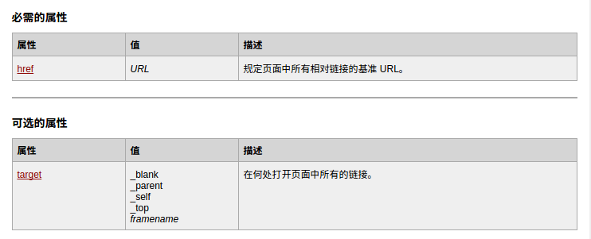
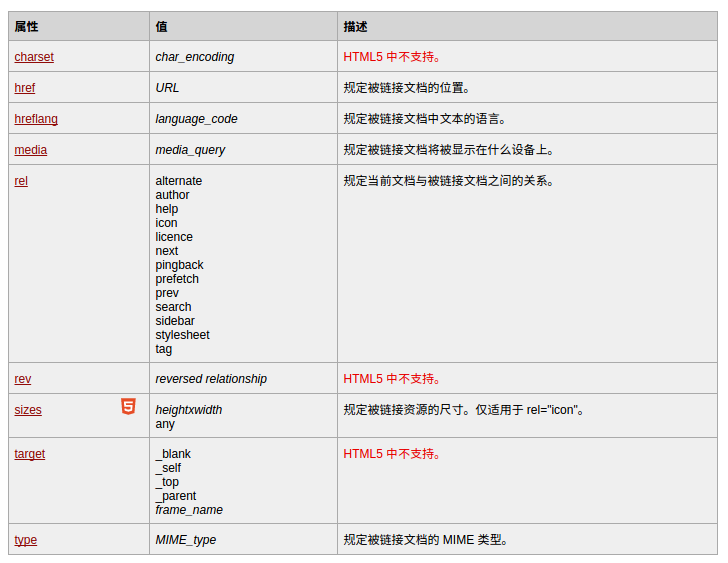
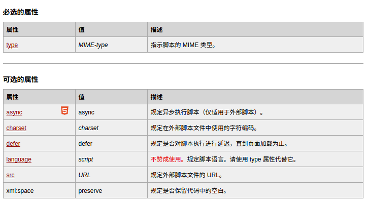
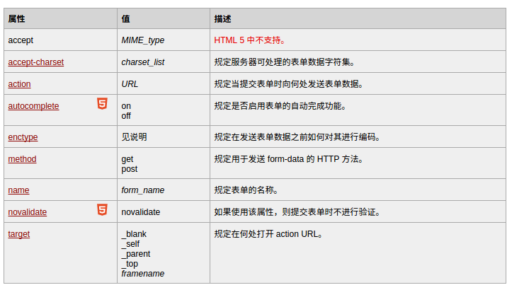
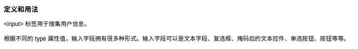
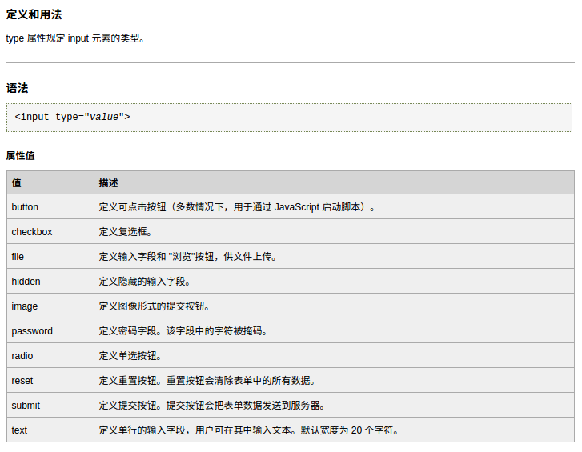

###系统学习原始基础的php,javascrtpt,html,css,myslq 
####html比较容易忽略的head标记 
base标签 
 
meta标签 
 
link标签 
 
script标签 
 
link标签用来定义与外部资源的关系，最常用的用途是添加CSS样式，还有添加标题栏图标，其中的rel=""规定当前文档与被链接文件之间的关系，是relation单词的缩写。href规定被链接文档的位置。script标签主要用来书写javascript脚本，或者链接外部的javascript脚本文件。base标签中的href规定页面中所有相对链接的基准地址。href是单词hypertext reference的缩写。meta标签提供有关页面的元信息，定义了与文档相关联的名称/值对。网页的关键词，供搜索引擎使用。 
 
 
form标签中action属性，用来规定当提交表单时向何处发送表单数据。method属性，规定用于发送form-data的HTTP方法。 
 
 
input标签用于搜集用户信息，type有button,checkbox,file,image,text等属性。
